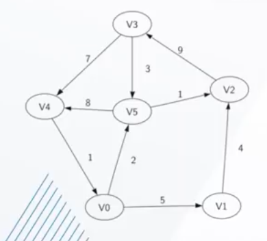
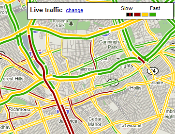
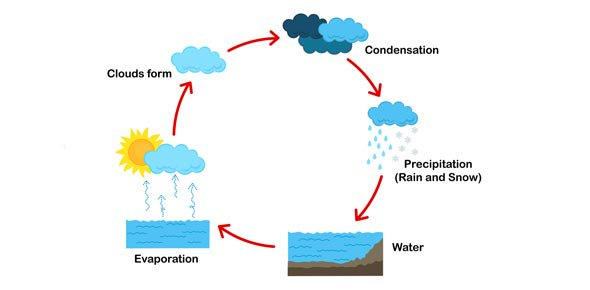
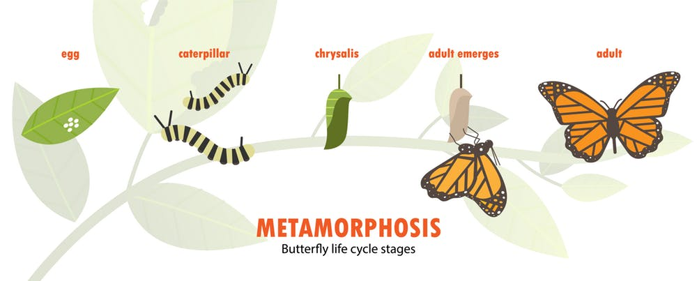
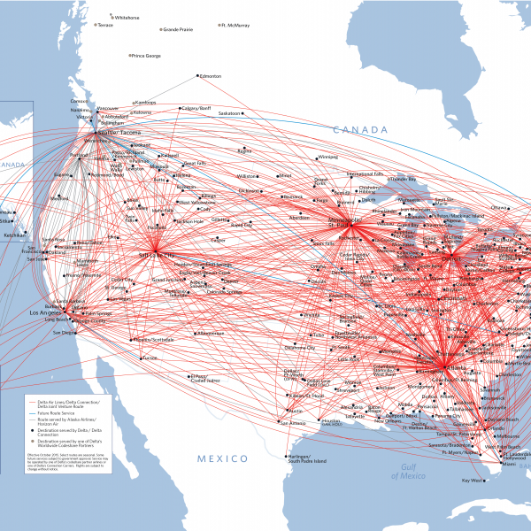
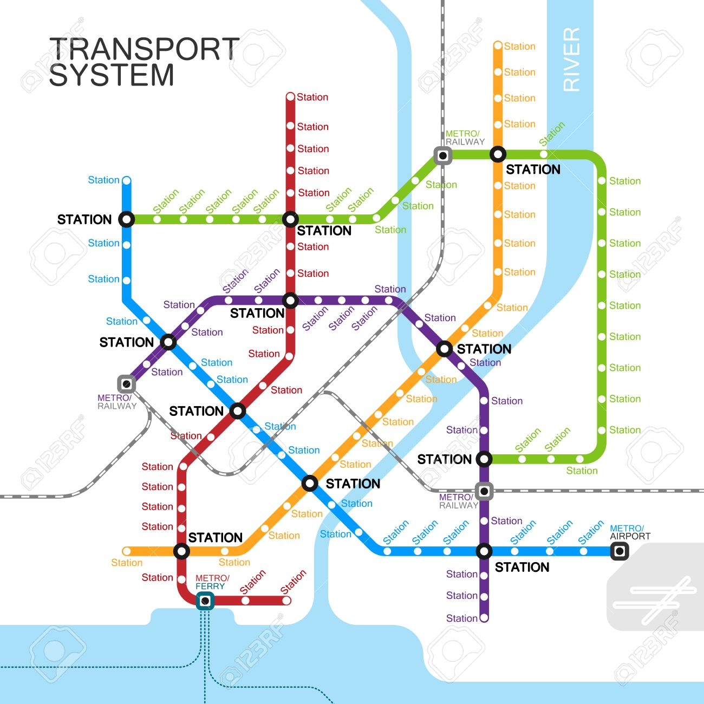
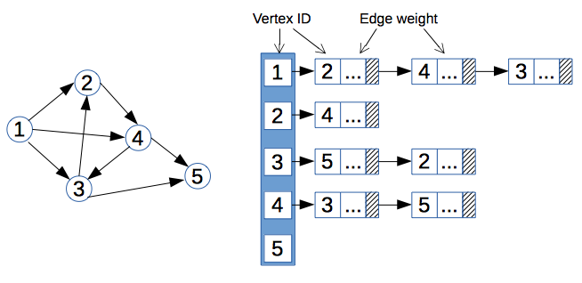
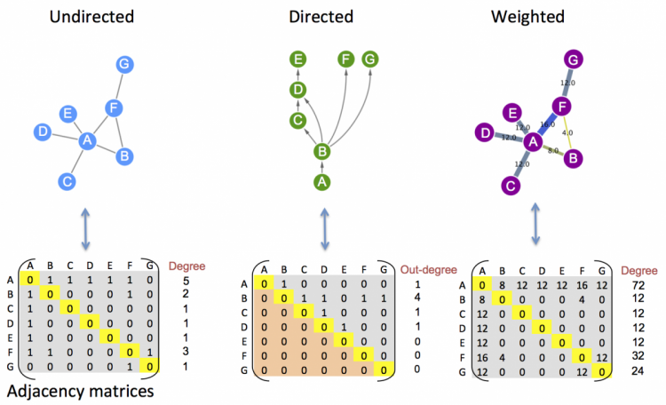

# Graphs

#### Pre-Class Resources

Intro to Graphs - Components, Uses & Types: https://youtu.be/Etva3hOjGMU
Depth First Search: https://youtu.be/VTLI7l-Ah-8
Breadth First Search: https://youtu.be/BK_8-XVp5XA

Article: A Gentle Introduction to Graph Theory: https://medium.com/basecs/a-gentle-introduction-to-graph-theory-77969829ead8

# Lecture I Notes: Graphs Intro, Representations & BFS/DFS

#### What are Graphs?

Graphs are a generalized data structure that represent relationships between data like linked lists or a binary tree. Anything you can do in those data structures, you can do in a graph.

The components that make up a graph are:

- Nodes of Vertices: these represent objects in a data set (like cities, animals, web pages, etc)

- Edges: the connections between vertices, they can be bi-directional

- Weight: the cost to travel across an edge

For example, cities could be vertices, with roads as the edges that connect all the cities. Not all edges are created equally so it may take more time or resources to go from one node to another.



A real time application of adding weight to edges is showing a traffic map, where different colors correspond to higher or lower weights of traveling along the edges:



In video games, different types of terrain often slow down or hinder character movement. That is another use case of edge weights.

A literal edge weight cost might be money when considering flight costs -- some distances cost more, or some non-stop flights may be more expensive than layovers.


## Graph Types and Terms

They allow us to understand data and the relationship between the data better. For example, we might use a subway graph to understand to go from one station to another.

There are several types of graphs:

- `Directed Graph`: can only move in one direction along edges, like a single linked list. All the edges are directed from one vertex to another in a directed manner.

Some social networks are considered directed, because you can follow someone on Twitter but that doesn't mean they follow you. It is one directional. However, on Facebook, when you befriend someone, they become your friend too. This is bi-directional.

- `Undirected Graph`: allows movement in both directions along edges, like a doubly linked list. The edges have a two way relationship without a direction.

- `Cyclic Graph`: edges allow you to revisit at least one vertex, like a graph demonstrating the water cycle. There are states that water can revisit multiple times.




- `Acyclic Graph`: vertices can only be visited once. A recipe turned into a graph might be acyclic because some steps should only be done _once_. Or the lifespan of an animal -- each stage of life only occurs once.



The relationship between two nodes might be acyclic, but if within the entire graph there exists even one cyclical relationship between nodes, then it is a cyclic graph.


If there are no weights on the edges, it's considered an `Unweighted Graph`.


`Dense` graphs means that for the number of nodes that exist, there are a high number of edges -- like a flight hub map:




A `sparse` graph has a lower ratio of nodes to edges, like a subway map:




- `Directed Acyclic Graphs` (DAGs): a one directional, non-circular graph. Moving node-to-node, one way, without encountering the same node again. Trees are often DAGs but not all DAGs are trees.

GitHub uses DAGs for branching and then merging. It is one directional and there are no loops (it's not cyclical). If something is further down the commit change, it can't be moved to be earlier without breaking the chain of commits between both data points.

_Further reading: Introduction to DAGs and How They Differ From Blockchains: https://medium.com/fantomfoundation/an-introduction-to-dags-and-how-they-differ-from-blockchains-a6f703462090_


#### What will we be learning?

We'll work with traversals and searches - breadth first search v depth first search. These are two search types that _should_ be memorized in their most basic form; but depending on your graph implementation and data, those searches will need to be adjusted and tweaked.

You can turn almost any code challenge into a graph - because everything can be turned into a graph that shows the relationship between data. Graphs also come up frequently when interviewing and doing take home challenges.

We'll use _translation_ techniques to turn an algorithm into a graph.

Handling graph problems follow the same three steps each time:

1. Translate into Graph terminology
2. Build Your Graph
3. Traverse the Graph

_Further learning: Dijkstra's's Algorithm (shortest path first) is a form of Breadth First Search. Once you learn BFS, learning that would be easier._


When drawing out graphs, be sure to be specific with your arrows to properly visualize directions that data flow (for direct or undirected graphs, identifying cyclical graphs, etc.)


#### But seriously, do graphs matter?

From Steve Yegge's article on Get That Job At Google (https://steve-yegge.blogspot.com/2008/03/get-that-job-at-google.html):

```
Graphs

Graphs are, like, really really important. 
More than you think. Even if you already think 
they're important, it's probably more than you think.

There are three basic ways to represent a graph in 
memory (objects and pointers, matrix, and adjacency 
list), and you should familiarize yourself with each
representation and its pros and cons.

You should know the basic graph traversal algorithms:
breadth-first search and depth-first search. 
You should know their computational complexity, 
their tradeoffs, and how to implement them in real code.

You should try to study up on fancier algorithms, 
such as Dijkstra and A*, if you get a chance. 
They're really great for just about anything, 
from game programming to distributed computing to 
you name it. You should know them.

Whenever someone gives you a problem, think graphs. 
They are the most fundamental and flexible way of 
representing any kind of a relationship, so it's about 
a 50-50 shot that any interesting design problem has a 
graph involved in it. Make absolutely sure you can't think 
of a way to solve it using graphs before moving on to other
solution types. This tip is important!
```

Short answer: yes.


## How to Represent a Graph

There are several ways to represent graphs:

##### Adjacency List



Looking at the above graph, we can see that it is a directed, unweighted, cyclical graph.

An adjacency list is a way to represent that graph by listing out the vertices/nodes and showing both their directions and weights (if there are any).

This adjacency list shows a relationship from Vertex 1 to 2, 4 and 3. It then shows Vertex 2 to 4. 

We can think of each of these as _sets_.

If it were an undirected graph, we would need to list each edge twice, to represent each direction of the relationship between vertices.

##### Adjacency Matrix

This is a chart that holds one column and one row for each vertex on the graph.



If there is a 0, that means there is no edge between the two vertices; if there is a 1, then they do have a shared edge.

##### When do we use a list v a matrix?

We need to consider both our time and space complexity when deciding.

Let's go back to dictionaries v sets. A dictionary contains key value pairs for the data, whereas a set only contains the data. Sets are somewhat like dictionaries without the keys.

What are the drawbacks? Sets cannot have duplicates and are unordered (you're not guaranteed to get them in any particular order). 

With binary trees, order mattered. But with graphs, there is no "first", just references to the directions, so it's fine to use a set for representation because we don't care about order.

The time complexity of seeing if something is in a set is `O(1)` vs if it's in a list is `O(n)` time. A sorted list is `O(log n)` but that's still slower than O(1).

Sets use extra space because they store both a value _and_ a pointer, which means they take up more space in memory.

In most cases, the extra memory is not a big deal on sets until we start using extremely large data sets -- but it's a consideration to keep in mind.

Time complexity is good as a tool but it's not the _only_ tool we shoud use to evaluate the ideal solution to pursue.

##### Space and Time Complexity

Assuming `n` = total number of vertices in the graph, `E` = total number of edges in the graph, and `e` is the total number of edges per vertex....   

The space complexity of both a matrix and list are:

Adjacency Matrix: `O(n^2)` --> the number of nodes * number of nodes, because it's creating a column _and_ row for each node

Adjacency List: `O(n + E)` --> n for each entry, plus a list for every edge related to that entry

The Time Complexity of adding a vertex...

Adjacency Matrix: `O(n)`
Because we are having to add a column of 0s and 1s for each new vertex (aka adding to eat set) - so O(n) where n is the number of nodes.

Adjacency List: `O(1)`
Because adding a new key to a dictionary is a constant time equation.

The Time Complexity of removing a vertex...

Adjacency Matrix: `O(n^2)`
On the matrix, we'll simply remove the vertex reference on each row, then moving all the remaining vertex points in the set over one spot; and we do this one _every_ column. So it's the same as n*n, O(n^2)

Adjacency List: `O(n)`
On the adjacency list, we first have to remove B and its corresponding list of edges; but we also have to go through the remaining vertices and search their lists, to remove B as a referenced vertex as well.

The Time Complextiy of adding or removing an edge...

Adjacency Matrix: `O(1)`

Adjacency List: `O(1)`

Both of these are constant time operations because we are simply adding a reference in our list's set, or we are changing a 0 to a 1 in a column on the matrix.

The Time Complexity of 'Get All Edges From Vertex'...

This is a common use case. Say we want to find all the edges that originate from a specific vertex.

Adjacency Matrix: `O(n)`

Adjacency List: `O(1)`
With an adjacency list, we can easily fetch all the edges from the dictionary like so:

```
return self.vertex[v]
```

But with the adjacency Matrix, we have to iterate through each row to populate a list based on the results, like so:

```
# Where v2 is the row we need to check:
v_edges = []
for v2 in self.edges[v]:
    if self.edges[v][v2] > 0:
        v_edges.append(v2)
return v_edges
```

This is clearly more efficiently done with an adjacency list instead of an adjacency matrix.

##### Why do we use 1's and 0's on the adjacency matrix?

Currently the 0 represents no edge, and 1 indicates an edge exists, but with no weight. If we wanted to add weight to the edge, we could change the number there to the weight of that edge. (I.e. change it from 1 to 8.) See in the example below:


##### When do I use a matrix v list?

An adjacency matrix is best used when there are a lot of edges - if there aren't that many, they aren't memory efficient. Dense graphs are good for matrices.

A sparse graph is better for an adjacency list.

We also want to consider how often data changes when deciding between a list v matrix, given the time complexity of adding/removing vertices.

For now, we'll be focusing on adjacency lists mostly on this sprint.

55:47


BFS Steps:

```
# Create an empty set to store visited nodes
    # Create an empty Queue and enqueue & PATH TO the starting vertex
    # While the queue is not empty...
        # Dequeue the first PATH
        # GRAB THE VERTEX FROM THE END OF THE PATH
        # IF VERTEX = TARGET, RETURN PATH
        # If that vertex has not been visited...
            # Mark it as visited
            # Then add & PATH TO all of its neighbors to the back of the queue
                # Copy the path
                # Append neighbor to the back of the copy
                # Enqueue copy
```

DFS Steps:

```
# Create an empty set to store visited nodes
    # Create an empty Queue and enqueue the starting vertex
    # While the queue is not empty...
        # Dequeue the first vertex
        # If that vertex has not been visited...
            # Mark it as visited
            # Then add all of its neighbors to the back of the queue
```


# Lecture II 

A traversal search visits every single node in an order and does something (make a change, mark as visited, print, etc.).

In a Breadth-First Search, we're still traversing the nodes but only _looking_ for the target and return the item or the path to that node. We're returning the shortest path each time, whereas Depth First does not return the _shortest_ path.


If we're looking at this graph and try to find the shortest path from 1 to 6, it should return [1, 2, 4, 6].

If we were looking from 1 to 3, the shortest path is [1, 2, 3] but a perfectly valid answer would also be [1, 2, 4, 6, 3]. BFS will always gives us the shortest route whereas DFS might give us an alternate route that is not the shortest.


#### When do you use BFS over DFS?

BFS is good for giving the shortest path but the downsides are that you need to hold each entire row in memory (which is bad on a very wide graph where the solution is in depth).

Large sets of data/possible solutions is better for DFS (memory efficient) but BFS is best for when we want the shortest path. If we need to go deep into a tree, DFS is better.

Sometimes it doesn't matter.

BFS always returns the shortest path because it looks at _all_ the possibilities to find something 1 step away, then 2 steps away, then 3 steps away....until it finds a successful path.

With DFS, it's searching paths but not across all one path possibilites first. It's going down a path to see if it's a _possible_ path -- not if it's the shortest.

Let's try a recursive DFS algorithm:

```
def dft_recursive(self, starting_vertex, visited=set() ):
    # Print each vertex in depth-first order beginning from starting_verex. This should be done using recursion.

    # If the node hasn't been visited...
    if starting_vertex not in visited:
        # Mark the node as visited
        print(starting_vertex)
        visited.add(starting_vertex)
    # Then call DFT_recursive on each child
    for neighbor in self.vertices[starting_vertex]:
        self.dft_recursive(neighbor, visited)

```

While this solution would work once, why won't it work if it gets called more than once?

Python handles default values a little uniquely. `visited=set()` will create this default value once and use it each time, referencing the same place in memory, even if we want to call it a second time where the set() should initialize as a different value.

This is a common Python gotcha, but not the case in other languages (like Ruby).

Instead, we need to initialize like so:

```
def dft_recursive(self, starting_vertex, visited=None ):
    # Print each vertex in depth-first order beginning from starting_verex. This should be done using recursion.
    if visited is None:
        visited = set()
```

We have to always set it to None and then initialize it within the function, if we want a default value to be set to variable data.

#### Why can we do DFS recursively but not really BFS?

Recursion has to be called on a new node each time, independently each time. But BFS puts all of the children into the queue at the same time, so it can't be used recursively.

(There is a way to search BFS with a while loop that is not entirely recursion but similar.)


##### How does DFS work on each loop?

Looking at this example graph, let's find a path from 1 to 3:


We want to find a path from our starting vertex (1) to the destination vertex (3)

```
start = 1
target = 3

stack = [] # stack
visited = {} # set
```

The first loop goes:

```
stack = [1]
visited = {}

path = [1]
path_copy = [1, 2]
v = 1
```

The next loop:

```
stack = [1,2]
visited = {1}

path = [1, 2]
path_copy = [1, 2, 3]
v = 2
```

But there's also a path to [1,2,4] so we need:

```
path = [1, 2]
path_copy = [1, 2, 4]
```

So now...

```
stack = [ [1,2,3], [1,2,4]]
visited = {1, 2}

path = [1,2 4]
path_copy = [1, 2, 4, 6]
v = 3

path = [1,2 4]
path_copy = [1, 2, 4, 7]
v = 3
```

Next loop:

```
stack = [ [1,2,3], [1,2,4,6], [1,2,4,7]]
visited = {1, 2, 4}

path = [1,2,4,7]
path_copy = [1, 2, 4, 7, 6]
v = 4
```

Next loop:

```
stack = [ [1,2,3], [1,2,4,6], [1,2,4,7]]
visited = {1, 2, 4, 7}

path = [1,2,4,7,6]
path_copy = [1, 2, 4, 7, 6, 3]
v = 5
```

Next loop:

```
stack = [ [1,2,3], [1,2,4,6], [1,2,4,7,6,3]]
visited = {1, 2, 4, 7,6}

path = [1,2,4,7,6,3]
```

Since 3 is our target, we return the path. It's not the shortest but that's how DFS iterates through, checking the possibilities of each path.


### Let's try an example problem

Using Leet Code's Word Ladder problem (https://leetcode.com/problems/word-ladder/)

```
Given two words (beginWord and endWord), and a dictionary's word list, find the length of shortest transformation sequence from beginWord to endWord, such that:

Only one letter can be changed at a time.
Each transformed word must exist in the word list. Note that beginWord is not a transformed word.
```

We want to change one letter at a time and see if this word exists in the given list.

Let's use POLYA and our steps for solving graph problems.

1. Translate the problem
2. Build your graph
3. Traverse your graph


##### How do we recognize that this is a graph problem? 

It doesn't look ike a graph problem off the bat. We need to look for some key words, like "shortest transformation sequence" or are seeking the relationships between things (words are one letter away).

Many coding challenges are graph problems, because they're tricky and they contain many data structures and concepts. They're usually shorter on code for a solution once the idea is solved.

First, let's translate this problem into graph terminology.

What are the nodes, edges, weights and how do we traverse the graph?

Words are our vertices. Neighbors are our edges (connection between words that are only one letter apart).

Using the first example:

```
Input:
beginWord = "hit",
endWord = "cog",
wordList = ["hot","dot","dog","lot","log","cog"]
```

Starting vertex is "hit", goal vertex is "cog".

We should use BFS because the problem is asking us for the _shortest_ path.

"Transformation sequence" should make you think of BFS as well. 

"Word" is the graph vertex. "One letter change" is the graph edge.


##### Build Your Graph

What graph operations are necessary?
Our vertex list needs to become a word list.

We need to define a function to get all edges (neighbors).

Using our basic BFS formula (that is being memorized):

```
# Implement our traversal
def find_ladders(beginWord, endWord):
    visited = set()
    q = Queue()
    q.enqueue( [beginWord] )
    while q.size() > 0:
        path = q.dequeue()
        v = path[-1]
        if v not in visited:
            visited.add(v)
            if v == endWord:
                return path
            for neighbor in get_neighbors(v):
                path_copy = list(path)
                path_copy.append(neighbor)
                q.enqueue(path_copy)
```

Now we need to define our `getNeighbors()` function that's being called.

We could loop over the letters in both words, at the same time, and set a count variable for all differences. If the count is exactly 1, then it's a neighbor. This comparison would be O(n) time where n is the length of the wordList we're comparing the given word to.

That's not a problem when the list has 7 words, but an issue when it contains a full dictionary of words in the tens of thousands.

We could search using a "wild card" by trying to find the neighbors of "cab" by searching for all words that would match `"*ab"`, `"c*b"`, and `"ca*"`.

We would start by placing our wordList into a set.

```
word_set = set(["hot", "dot", "dog", "lot", "log", "cog"])
```

If we searched the wildcard of `*it`:

`ait`
`bit`
`cit`
`dit`...

and so on, checking 26 possibilities if they are in the set.

We'll repeat this for each following letter in the word.

This is also `O(n)` but where n is the word length, not the wordlist we search through. While it's O(26 * n), that's not very long compared to the tens of thousands of a word list.

Understanding how to compare O(n) where n is a different variable helps us decide which method of solving a problem is more efficient.

Let's test out our get_neighbors function:

```
word_set = set(["hot", "dot", "dog", "lot", "log", "cog"])

letters = ['a', 'b', 'c', 'd', 'e', 'f', 'g', 'h', 'i', 'j', 'k', 'l', 'm', 'n', 'o', 'p', 'q', 'r', 's', 't', 'u', 'v', 'w', 'x', 'y', 'z']

# Get neighbors function
def get_neighbors(word):
    # A neighbor is all words in the word list that differ by exactly one letter
    
    # create an empty neighbors list
    neighbors = []
    # turn our word into an array of characters
    string_word = list(word)
    # for each letter in the word...
    for i in range(len(string_word)):
        # For each letter in the alphabet...
        for letter in letters:
            # Make a copy so we don't override our item
            # swap that letter with a letter in the alphabet
            temp_word = list(string_word)
            temp_word[i] = letter
            # reform it into a word string and check if it's in word_set
            w = "".join(temp_word)
            # if it doesn't equal the original word and it's in the set, add to neighbors
            if w !== word and w in word_set:
                neighbors.append(w)
```

Now that both functions are written, we can use get_neighbors to run a BFS and efficiently solve this code challenge.

But how would this solution scale if we have a wordList with over 200,000 words? 

Testing against a large data set is a good way to see how efficient our solution is.

It's still running quickly. The set allows us to check efficiently.

So, overall, this ladder problem was just a path finding problem, perfecting for graphing.

Today's assignment is solving the Earliest Ancestor code challenge.


