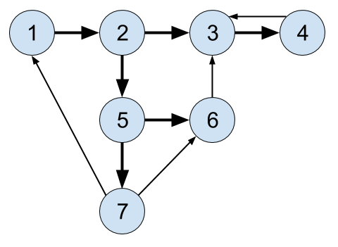

# Graphs

## Table of Contents

1. [Lecture I: Graphs Intro, Representation & BFS/DFS](#Lecture-I-Notes:-Graphs-Intro,-Representations-&-BFS/DFS)
2. [Lecture II: Applied Graph Search](#Lecture-II)
    <br>a. [When do you use BFS over DFS?](#When-do-you-use-BFS-over-DFS?)
    <br>b. [Why can we use DFS recursively?](#Why-can-we-do-DFS-recursively-but-not-really-BFS?)
    <br> c. [Example Code Challenge](#Let's-try-an-example-problem)
    <br>
    <br>
3. [Lecture III: Random Social Network](#Lecture-III:-Random-Social-Network)


# Lecture II 

[Lecture II Recording](https://www.youtube.com/watch?v=Yi7V4AzhFPc)

A traversal search visits every single node in an order and does something (make a change, mark as visited, print, etc.).

In a Breadth-First Search, we're still traversing the nodes but only _looking_ for the target and return the item or the path to that node. We're returning the shortest path each time, whereas Depth First does not return the _shortest_ path.




If we're looking at this graph and try to find the shortest path from 1 to 6, it should return [1, 2, 4, 6].

If we were looking from 1 to 3, the shortest path is [1, 2, 3] but a perfectly valid answer would also be [1, 2, 4, 6, 3]. BFS will always gives us the shortest route whereas DFS might give us an alternate route that is not the shortest.


#### When do you use BFS over DFS?

BFS is good for giving the shortest path but the downsides are that you need to hold each entire row in memory (which is bad on a very wide graph where the solution is in depth).

Large sets of data/possible solutions is better for DFS (memory efficient) but BFS is best for when we want the shortest path. If we need to go deep into a tree, DFS is better.

Sometimes it doesn't matter.

BFS always returns the shortest path because it looks at _all_ the possibilities to find something 1 step away, then 2 steps away, then 3 steps away....until it finds a successful path.

With DFS, it's searching paths but not across all one path possibilites first. It's going down a path to see if it's a _possible_ path -- not if it's the shortest.

Let's try a recursive DFS algorithm:

```
def dft_recursive(self, starting_vertex, visited=set() ):
    # Print each vertex in depth-first order beginning from starting_verex. This should be done using recursion.

    # If the node hasn't been visited...
    if starting_vertex not in visited:
        # Mark the node as visited
        print(starting_vertex)
        visited.add(starting_vertex)
    # Then call DFT_recursive on each child
    for neighbor in self.vertices[starting_vertex]:
        self.dft_recursive(neighbor, visited)

```

While this solution would work once, why won't it work if it gets called more than once?

Python handles default values a little uniquely. `visited=set()` will create this default value once and use it each time, referencing the same place in memory, even if we want to call it a second time where the set() should initialize as a different value.

This is a common Python gotcha, but not the case in other languages (like Ruby).

Instead, we need to initialize like so:

```
def dft_recursive(self, starting_vertex, visited=None ):
    # Print each vertex in depth-first order beginning from starting_verex. This should be done using recursion.
    if visited is None:
        visited = set()
```

We have to always set it to None and then initialize it within the function, if we want a default value to be set to variable data.

#### Why can we do DFS recursively but not really BFS?

Recursion has to be called on a new node each time, independently each time. But BFS puts all of the children into the queue at the same time, so it can't be used recursively.

(There is a way to search BFS with a while loop that is not entirely recursion but similar.)


##### How does DFS work on each loop?

Looking at this example graph, let's find a path from 1 to 3:


We want to find a path from our starting vertex (1) to the destination vertex (3)

```
start = 1
target = 3

stack = [] # stack
visited = {} # set
```

The first loop goes:

```
stack = [1]
visited = {}

path = [1]
path_copy = [1, 2]
v = 1
```

The next loop:

```
stack = [1,2]
visited = {1}

path = [1, 2]
path_copy = [1, 2, 3]
v = 2
```

But there's also a path to [1,2,4] so we need:

```
path = [1, 2]
path_copy = [1, 2, 4]
```

So now...

```
stack = [ [1,2,3], [1,2,4]]
visited = {1, 2}

path = [1,2 4]
path_copy = [1, 2, 4, 6]
v = 3

path = [1,2 4]
path_copy = [1, 2, 4, 7]
v = 3
```

Next loop:

```
stack = [ [1,2,3], [1,2,4,6], [1,2,4,7]]
visited = {1, 2, 4}

path = [1,2,4,7]
path_copy = [1, 2, 4, 7, 6]
v = 4
```

Next loop:

```
stack = [ [1,2,3], [1,2,4,6], [1,2,4,7]]
visited = {1, 2, 4, 7}

path = [1,2,4,7,6]
path_copy = [1, 2, 4, 7, 6, 3]
v = 5
```

Next loop:

```
stack = [ [1,2,3], [1,2,4,6], [1,2,4,7,6,3]]
visited = {1, 2, 4, 7,6}

path = [1,2,4,7,6,3]
```

Since 3 is our target, we return the path. It's not the shortest but that's how DFS iterates through, checking the possibilities of each path.


### Let's try an example problem

Using Leet Code's Word Ladder problem (https://leetcode.com/problems/word-ladder/)

```
Given two words (beginWord and endWord), and a dictionary's word list, find the length of shortest transformation sequence from beginWord to endWord, such that:

Only one letter can be changed at a time.
Each transformed word must exist in the word list. Note that beginWord is not a transformed word.
```

We want to change one letter at a time and see if this word exists in the given list.

Let's use POLYA and our steps for solving graph problems.

1. Translate the problem
2. Build your graph
3. Traverse your graph


##### How do we recognize that this is a graph problem? 

It doesn't look ike a graph problem off the bat. We need to look for some key words, like "shortest transformation sequence" or are seeking the relationships between things (words are one letter away).

Many coding challenges are graph problems, because they're tricky and they contain many data structures and concepts. They're usually shorter on code for a solution once the idea is solved.

First, let's translate this problem into graph terminology.

What are the nodes, edges, weights and how do we traverse the graph?

Words are our vertices. Neighbors are our edges (connection between words that are only one letter apart).

Using the first example:

```
Input:
beginWord = "hit",
endWord = "cog",
wordList = ["hot","dot","dog","lot","log","cog"]
```

Starting vertex is "hit", goal vertex is "cog".

We should use BFS because the problem is asking us for the _shortest_ path.

"Transformation sequence" should make you think of BFS as well. 

"Word" is the graph vertex. "One letter change" is the graph edge.


##### Build Your Graph

What graph operations are necessary?
Our vertex list needs to become a word list.

We need to define a function to get all edges (neighbors).

Using our basic BFS formula (that is being memorized):

```
# Implement our traversal
def find_ladders(beginWord, endWord):
    visited = set()
    q = Queue()
    q.enqueue( [beginWord] )
    while q.size() > 0:
        path = q.dequeue()
        v = path[-1]
        if v not in visited:
            visited.add(v)
            if v == endWord:
                return path
            for neighbor in get_neighbors(v):
                path_copy = list(path)
                path_copy.append(neighbor)
                q.enqueue(path_copy)
```

Now we need to define our `getNeighbors()` function that's being called.

We could loop over the letters in both words, at the same time, and set a count variable for all differences. If the count is exactly 1, then it's a neighbor. This comparison would be O(n) time where n is the length of the wordList we're comparing the given word to.

That's not a problem when the list has 7 words, but an issue when it contains a full dictionary of words in the tens of thousands.

We could search using a "wild card" by trying to find the neighbors of "cab" by searching for all words that would match `"*ab"`, `"c*b"`, and `"ca*"`.

We would start by placing our wordList into a set.

```
word_set = set(["hot", "dot", "dog", "lot", "log", "cog"])
```

If we searched the wildcard of `*it`:

`ait`
`bit`
`cit`
`dit`...

and so on, checking 26 possibilities if they are in the set.

We'll repeat this for each following letter in the word.

This is also `O(n)` but where n is the word length, not the wordlist we search through. While it's O(26 * n), that's not very long compared to the tens of thousands of a word list.

Understanding how to compare O(n) where n is a different variable helps us decide which method of solving a problem is more efficient.

Let's test out our get_neighbors function:

```
word_set = set(["hot", "dot", "dog", "lot", "log", "cog"])

letters = ['a', 'b', 'c', 'd', 'e', 'f', 'g', 'h', 'i', 'j', 'k', 'l', 'm', 'n', 'o', 'p', 'q', 'r', 's', 't', 'u', 'v', 'w', 'x', 'y', 'z']

# Get neighbors function
def get_neighbors(word):
    # A neighbor is all words in the word list that differ by exactly one letter
    
    # create an empty neighbors list
    neighbors = []
    # turn our word into an array of characters
    string_word = list(word)
    # for each letter in the word...
    for i in range(len(string_word)):
        # For each letter in the alphabet...
        for letter in letters:
            # Make a copy so we don't override our item
            # swap that letter with a letter in the alphabet
            temp_word = list(string_word)
            temp_word[i] = letter
            # reform it into a word string and check if it's in word_set
            w = "".join(temp_word)
            # if it doesn't equal the original word and it's in the set, add to neighbors
            if w !== word and w in word_set:
                neighbors.append(w)
```

Now that both functions are written, we can use get_neighbors to run a BFS and efficiently solve this code challenge.

But how would this solution scale if we have a wordList with over 200,000 words? 

Testing against a large data set is a good way to see how efficient our solution is.

It's still running quickly. The set allows us to check efficiently.

So, overall, this ladder problem was just a path finding problem, perfecting for graphing.

Today's assignment is solving the Earliest Ancestor code challenge.

<br>
<br>
<br>
<br>
<br>
<br>

# Lecture III: Random Social Network

[Lecture III Recording](https://www.youtube.com/watch?v=RPWUmNEOxpk)

#### Pre-Class Resources

[Graphs: Connected Components](#https://youtu.be/EsyLzGWlsA8)

[Follow Along Lecture Repo](#https://github.com/LambdaSchool/Graphs/tree/master/objectives/randomness)


<br>
<br>
<br>
<br>
<br>
<br>


# Lecture IV: Maze Traversal

[Lecture IV Recording](https://www.youtube.com/watch?v=p263i-Shn9o)

#### Pre-Class Resources


Today we're going to go over the social network problems and work on the adventure project within the Graphs Sprint repo.


#### Social Network Model Solution

We want to create a number of users and randomly distribute friendships between them, such that the average friendships per user matches the given integer.

Remember, friendship relationships are (usually) undirected so we always need to create two edges. You cannot be friends with yourself or create a duplicate one.

First we want to add users in our `social.py` file:

```
        # Add users
        for i in range(numUsers):
            self.addUser(f"User {i + 1}")
```

Now we need to create all possible friendships:

```
# Create friendships
# numUsers * average number of friendships is how many we should create
# n = total users * average friendships / 2

# First generate all possible friendships (if user 1 is friends with everyone, 2-10; then, user 2 doesn't need to add user 1, but 3 -10, etc.. until every possible friendship that could be created is generated)

possibleFriendships = []
for userID in self.users:
    # this doesn't include the users ID but does include the last possible friend ID
    for friendID in range(userID + 1, self.lastID + 1):
        possibleFriendships.append((userID, friendID))
    # This prints all possible combos without duplicates
```

What is the time complexity of this? 

O(n) for the first loop because we are iterating through all the users; but on the nested loop, we go through some (but not all) of the users on each loop (progressively fewer with each loop as we near the end).

This is still O(n^2) even though the second loop doesn't go through all of n with each loop, it averages 1/2 * n ( O(n/2) ), but removing the qualifying integer, it's still O(n) * O(n) = `O(n^2)`.

Now let's actually create the friendships and assign them friendships:

```
# Now we need to actually create users and assign them friendships at random

friendshipsToCreate = random.sample(possibleFriendships, (numUsers * avgFriendships) // 2)
print(friendshipsToCreate)

for friendship in friendshipsToCreate:
    self.addFriendship(friendship[0], friendship[1])

# This results in roughly 2 average friendships per user, even though the friendships are randomly assigned (so some will have 3 or 4, and others only 1 or 2)
```

If we wanted to do this with a shuffle instead of a random.sample(), it might look like this:

```
        friendshipsToCreate = (numUsers * avgFriendships) // 2
        random.shuffle(possibleFriendships)
```

We can check the time it takes to run by adding in some time variables and printing the difference:

```
if __name__ == '__main__':
    sg = SocialGraph()
    start_time = time.time()
    sg.populateGraph(10, 2)
    print(sg.friendships)
    end_time = time.time()
    connections = sg.getAllSocialPaths(1)

    print(f'Runtime: {end_time - start_time} seconds')
    print(connections)
```


#### Implement Degrees of Separation

Now let's try to `getAllSocialPathts(self, userID)`. We'll pass in a userID and return the extended network, and the shortest path between the user and each person in the extended network. 

We're going between each user in the extended network and calculating the distance between that user and the primary user.

We need to use a Breadth First Search (shortest path). We'll need to store the result in a dictionary instead of a set.

```
visited = {}  # Note that this is a dictionary, not a set
# Create empty queue
q = Queue()
q.enqueue( [userID] )
while q.size() > 0:
    path = q.dequeue()
    v = path[-1]
    # Check if visited
    if v not in visited:
        # Store the social path in the visited dictionary
        visited[v] = path
        # Friendships is our edges adjacency list
        for neighbor in self.friendships[v]
            path_copy = list[path]
            path_copy.append(neighbor)
            q.enqueue(path_copy)
return visited
```

This is following the same BFS algorithm that we've worked with all week. Again, memorizing the basic outline will help to implement BFS and DFS easily.

Is this model accurate to real life?

Not exactly. Friendships aren't random. They're usually formed in clusters - Lambda school friendships are probably clustered around the cohort they're in.

Randomness is a powerful tool but can also be limited in reflecting real life.

What is another way we could create these friendships at a linear runtime?

Here we'll account for collisions and continue to run the algorithm until we don't run into a collision.

```
def populateGraphLinear(self, numUsers, avgFriendships):
    # reset graph
    self.lastID = 0
    self.users = {}
    self.friendships = {}

    for i in range(numUsers):
        self.addUser(f'User {i +1}')

    targetFriendships = numUsers * avgFriendships
    totalFriendships = 0
    # A collision is a failed friendship - trying to create one with yourself or one that already exists
    collisions = 0
    while totalFriendships < targetFriendships:
        userID = random.randint(1, self.lastID)
        friendID = random.randint(1, self.lastID)
        if self.addFriendship(userID, friendID):
            totalFriendships += 2
        else:
            collisions += 1
    print(f"Collisions: {collisions}")
```

This has a _much_ faster run time than our previous solution, which has `O(n^2)` runtime, when accounting for the worst case scenario with the nested loops.

If we consider this within an app, knowing if our scale reaches over 10,000 users, the run time of our previous solution would be unacceptable.

Despite this efficiency, when would we maybe not want to use this solution?

The total number of friendships must be less than the number of users - but if it was only _one_ less.... (100 users, each with 99 friends), the number of times it runs into collisions becomes high enough to be detrimental to performance.

In that case, the quadratic equation would perform better because it does not have collision issues.

If we were to write this for a network where we might assume that almost everyone in the network is a friend with everyone else, the quadratic solution would be more performant, even if it doesn't scale well.

Random sampling performs better with sparse graphs.

The shuffle quadratic sampling performs better with dense graphs.


#### Adventure Map Traversing

This last portion of the project is both your project and Sprint Challenge. Because of its level of difficulty, you have extra time to work on it.

Like a previous repo, we have an `adv.py` file and associated room, player and room files that help us travel (in the class Player).

Our 500 room map allows us to walk North, South, East and West.

There is also visualization code (`python3 adv.py`) to see the map with built in tests that show how many rooms are unvisited.

If we uncomment the REPL code in that file, we can walk around to experiment with how to navigate through the maze.

Our job is to fill out the traversal path with directions.

If we fill it in like so:

```
traversalPath = ['n']
```

Our tests will return that we have 498 unvisited rooms (since we successfully moved to a new room).

We might continue to fill it out like so:

```
traversalPath = ['n', 's', 's', 'w']
```

We can add this code to our room class to print when we visit a room:

```
def __repr__(self):
    return self.name
```

There are also smaller graphs that we can uncomment to use as easier sample graphs for building and testing a solution.

Thinking about this, it's a depth first search because we are not searching level by level, but instead by path.

If we implemented BFS, we'd be backtracking constantly.

With DFS, we're only backtracking after hitting the end of any single path.

Start a graph and begin to build it as you traverse the graph:

```
graph = {}
graph[0] = {'n': '?', 's': '?', 'w': '?', 'e': '?'}


print(player.currentRoom.id)
print(player.currentRoom.getExits())
```

If we move north one room, we'll see that we're now in room one, so we know now that 'n' actually leads to room 1, and that in room 1, 's' leads to room 0:

```
graph[0]['n'] = 1
graph[1] = {'n': '?', 's': '?', 'w': '?', 'e': '?'}
graph[1]['s'] = 0
```

Keep building an algorithm that explores every possible exit and fills in the explored paths.

But when we hit a room where all the explored exits have been marked, how do we determine where to go from our graph code?

A room with an unexplored exit has a '?', so we need to find the nearest room with a '?'. We might use BFS to find the _nearest_ (aka, shortest) path with an unexplored exit.

Solely backtracking will get us to a room we have not fully explored, but that's not the most efficient way to get there (as you might backtrack along paths fully explored, to deep levels).

How do you know when your path is complete and you've explored every single room?

Our traversalPath length won't match the number of rooms because we will need to backtrack eventually - so it'll actually be roughly twice as many path moves than rooms.

When entries in the graph equal the number of rooms, then we know it's complete - or when the exit dictionary contains no question marks.

HINT: A stack DFS might not be the best. It may lead you to complications.

HINT: How do you turn a list of exits (n, s, e, w), into a dictionary filled with question marks?

When in doubt, use POLYA and stayed neat, organized, and well-planned.

>Beautiful is better than ugly.  
>Explicit is better than implicit.  
>Simple is better than complex.  
>Complex is better than complicated.  
>Flat is better than nested.  
>Sparse is better than dense.  
>Readability counts.  
>Special cases aren't special enough to break the rules.  
>Although practicality beats purity.  
>Errors should never pass silently.  
>Unless explicitly silenced.  
>In the face of ambiguity, refuse the temptation to guess.  
>There should be one-- and preferably only one --obvious way to do it.  
>Although that way may not be obvious at first unless you're Dutch.  
>Now is better than never.  
>Although never is often better than *right* now.  
>If the implementation is hard to explain, it's a bad idea.  
>If the implementation is easy to explain, it may be a good idea.  
>Namespaces are one honking great idea -- let's do more of those!  

  
  


help(random.sample) pulls up info on how to use that in the terminal. What is that extension?