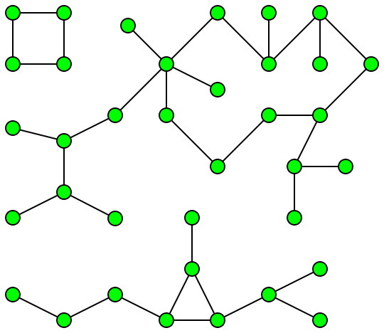

3. [Lecture III: Random Social Network](#Lecture-III:-Random-Social-Network)
    <br>a. [Pre-Class Resources](#Pre-Class-Resources)
    <br>b. []()
    <br>c. []()
    <br>


<br>
<br>

# Lecture III: Random Social Network

## Pre-Class Resources

[Graphs: Connected Components](#https://youtu.be/EsyLzGWlsA8)

[Follow Along Lecture Repo](#https://github.com/LambdaSchool/Graphs/tree/master/objectives/randomness)


## Social Connections

_ CS19 Brian Doyle covers this at the end of Lecture II, while CS18 Brady Fukumoto covers this in Lecture III_

We're tasked with building a bi-directional graph full of the connections between people, to determine the degrees of separation.

In our project repo, there are thorough directions. For now, the base file is copied into [here](lecture3.py). It starts with a Queue class, as well as a User and Social Graph, with some pre-made methods.

<br>

A `connected component` is a set of nodes that are all connected to one another but not the rest of the graph, like this isolated square:



Sometimes we'll need to find the sets that are connected components.

<br>

When we think about `random`, as people, we inherently try to apply patterns to keep things "even". But truly random data still has clusters and is unlikely to be evenly randomized.

When flipping a coin, there is a high liklihood of repetitive heads and tails -- even 6 in a row. If we were to mimic the flipping of a coin, we would tend to randomize _away from_ repetition, to keep a 50-50 pattern.

<br>
<br>

## Populate Graph

The file asks us to implement the populate graph method:

<br>

```
def populateGraph(self, numUsers, avgFriendships):
    """
    Takes a number of users and an average number of friendships
    as arguments

    Creates that number of users and a randomly distributed friendships
    between those users.

    The number of users must be greater than the average number of friendships.
    """
    # Reset graph
    self.lastID = 0
    self.users = {}
    self.friendships = {}
    # !!!! IMPLEMENT ME

    # Create friendships
    # numUsers * average number of friendships is how many we should create
    # n = total users * average friendships / 2

    # First generate all possible friendships (if user 1 is friends with everyone, 2-10; then, user 2 doesn't need to add user 1, but 3 -10, etc.. until every possible friendship that could be created is generated)
```

<br>

First, let's add our users:

<br>

```
# Add users
    for i in range(numUsers):
        self.addUser(f"User {i + 1}")
```

<br>

Next, let's generate all the possible friendships that could be created:

<br>

```
possibleFriendships = []

for userID in self.users:
    # range is inclusive (+1: start after ourselves) and exclusive (+1: must make range go to one beyond our final to add)
    for friendID in range(userID + 1, self.lastID + 1):

        # this creates a list of all possible friendships without duplicates
        possibleFriendships.append((userID, friendID))

        # we can see how many this is by printing the length
        print(len(possibleFriendships))
```

<br>

To imitate randomness, we should shuffle up the list:

<br>

```
# let's randomize this list. random.shuffle() randomizes the list and returns None
random.shuffle(possibleFriendships)
```

<br>

Let's now make a list of friendships to create that are randomly chosen out of our randomized list of _possible_ friendships. 

<br>

```
# Now we need to actually create users and assign them friendships at random
# random.sample(list, k) chooses k unique elements from list
friendshipsToCreate = random.sample(possibleFriendships, (numUsers * avgFriendships) // 2)
```

<br>

Finally, let's actually create the friendships:

<br>

```
# loop through possible friends and create the friendships
for friendship in friendshipsToCreate:
    # grabs person 1 and person 2 of the possible friendship tuples
    self.addFriendship(friendship[0], friendship[1])
```

<br>

An alternate way that could be written is like so:

<br>

```
for i in range(0, math.floor((numUsers * avgFriendships)//2)):
    friendship = possibleFriendships[i]
    self.addFriendship(friendship[0], friendship[1])
```

<br>

This results in roughly 2 average friendships per user, even though the friendships are randomly assigned (so some will have 3 or 4, and others only 1 or 2)

We also want to add a `repr` method so that we can view the friendships being added properly (otherwise they show as `set()` which isn't useful).

<br>

```
def __repr__(self):
    return f"Friendships: {self.friendships}"
```

<br>
<br>
